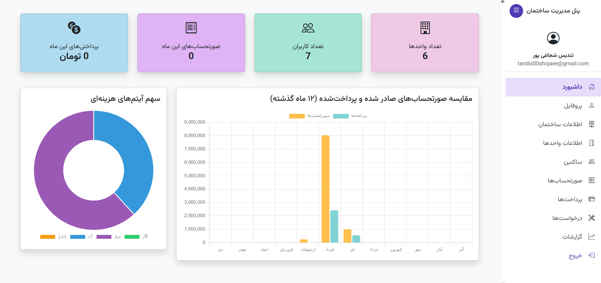
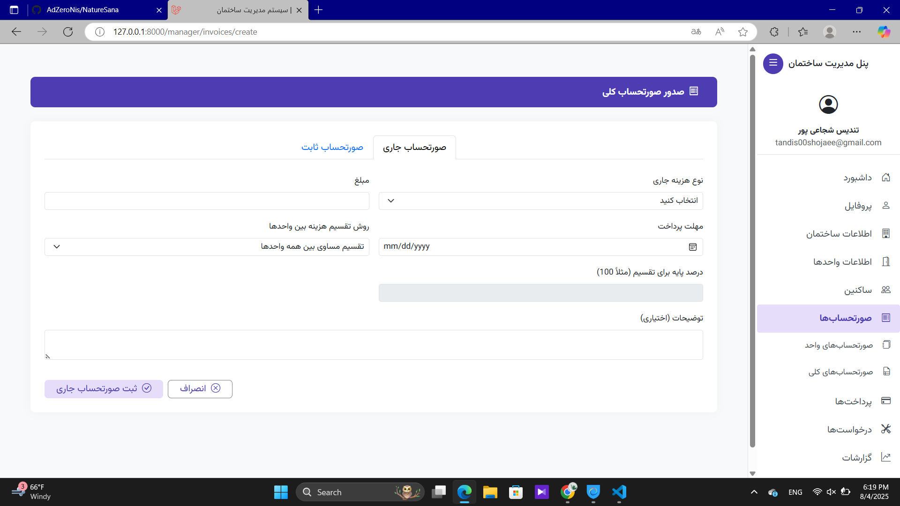
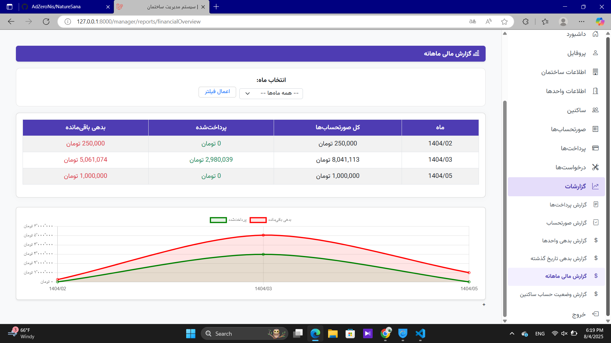

🏢 مدیریت ساختمان | سامانه هوشمند امور ساختمان
پروژه‌ای برای مدیریت مالی، عملیاتی و تعمیراتی ساختمان‌ها با نقش‌های مختلف

## 📝 درباره پروژه
این سامانه تحت وب با استفاده از فریم‌ورک Laravel توسعه داده شده و به کاربران با نقش‌های مختلف (سوپر ادمین، مدیر ساختمان، ساکن) امکان مدیریت دقیق امور ساختمان را می‌دهد. امکاناتی مانند صدور صورتحساب، پرداخت، مدیریت واحدها، ثبت ساکن، درخواست تعمیرات و مشاهده گزارش‌های مالی در آن گنجانده شده است.

## ✨ امکانات کلیدی:
- ثبت‌نام و ورود کاربران بر اساس نقش (ساکن، مدیر، سوپر ادمین)
- مدیریت ساختمان، واحدها و ساکنین توسط مدیر ساختمان
- صدور صورتحساب (تکی/گروهی، جاری/ثابت)
- پرداخت صورتحساب توسط ساکن (تکی و گروهی)
- ثبت و بررسی درخواست‌های تعمیر توسط ساکن و مدیر
- مشاهده داشبوردها و گزارش‌های تحلیلی
- پنل سوپر ادمین برای مدیریت کلی سامانه

## 🔧 تکنولوژی‌ها و ابزارها:
- PHP 8.1
- Laravel 12
- MySQL 8.0
- Eloquent ORM
- Bootstrap 5 (RTL)
- Blade Template Engine
- Git & GitHub
- WAMP Server

## قسمت هایی از وب سایت

